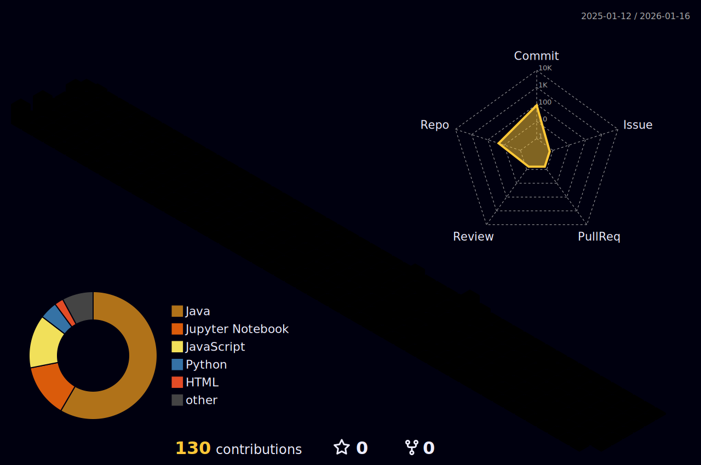

<!-- Profile Banner -->

  

---
<!-- Typing Animation -->

---

## 👩‍💻 About Me
- 🎓 B.Tech CSE (2023–2027)  
- 💻 Focused on **Java (Spring Boot), Python, AI/ML, SQL, React**  
- 🚀 Building impactful projects like **Wrist Wave** (safety wearable) & **Study Timer** (productivity tool)  
- 🌱 Always exploring **system design, algorithms, and emerging tech**  
- 🌌 Fun fact: *I find peace in chaos!*  
- 👨‍💻 All of my projects are available at [https://github.com/latenightcoder-git](https://github.com/latenightcoder-git)
- 📝 I mostly post my articles on [https://medium.com/@madhu_codes_cosmos](https://medium.com/@madhu_codes_cosmos)
---

## 🛠️ Tech Stack  

### 🚀 Languages & Tools  

---
### 📈Some other technologies I often use in Projects:

---

## 📊 GitHub Stats  

  
  

  

---
## 📊 3D Night Rainbow Contributions  

---
## 🐍 Snake Contributions  

---

## 🔥 Profile Views  

  

---

## 🌐 Connect With Me  

  
  
   

---

  

